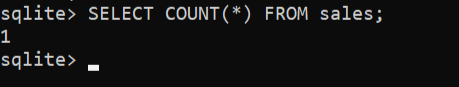
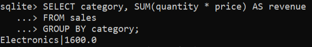
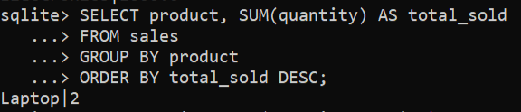
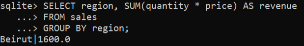

# Sales Data Analysis

## Description
This project analyzes sales data to extract insights using SQL.

## Tools Used
- SQLite
- Excel
- GitHub
- Swl Queries

## Files
- sales_data.csv : Dataset
- analysis.sql : SQL queries
- insights.md : Business insights

## Key Insights
- Highest revenue from Electronics category
- Beirut is the top-performing region
- Most sold products: Headphones, Mouse

## Results

### Rows Count

### Total Revenue

### Revenue by Category

### Top Products

### Revenue by Region
 

